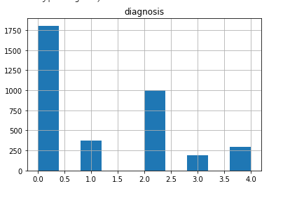
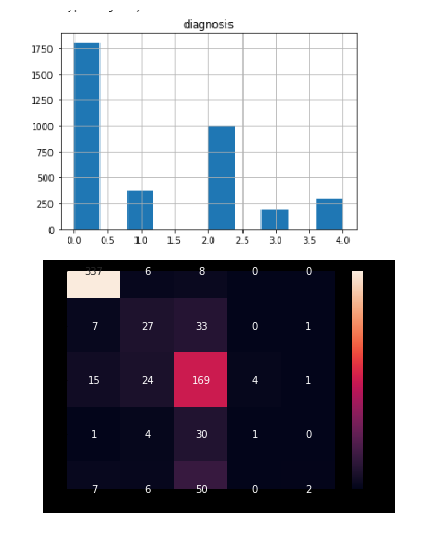
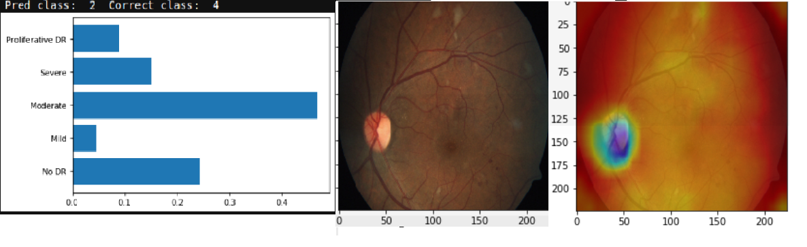
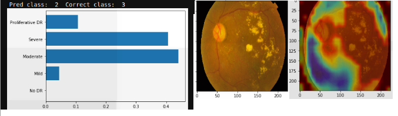
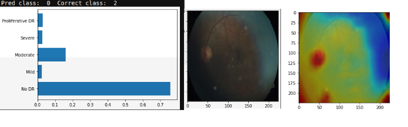

# [APTOS 2019 Blindness Detection](https://www.kaggle.com/c/aptos2019-blindness-detection)
___Detect diabetic retinopathy to stop blindness before it's too late___

## What is Diabetic Retinopathy (DR)?

<p align="center">
  
</p>

_Source: [Medical Diagnosis with a Convolutional Neural Network, TowardsDataScience](https://medium.com/m/global-identity?redirectUrl=https%3A%2F%2Ftowardsdatascience.com%2Fmedical-diagnosis-with-a-convolutional-neural-network-ab0b6b455a20)_


According to [this article](https://www.diabetes.co.uk/diabetes-complications/diabetic-retinopathy.html):

- Diabetic retinopathy is the most common form of diabetic eye disease. Diabetic retinopathy usually only affects people who have had diabetes (diagnosed or undiagnosed) for a significant number of years.
- Retinopathy can affect all diabetics and becomes particularly dangerous, increasing the risk of blindness, if it is left untreated.
-The risk of developing diabetic retinopathy is known to increase with age as well with less well controlled blood sugar and blood pressure level.
- According to the NHS, 1,280 new cases of blindness caused by diabetic retinopathy are reported each year in England alone, while a further 4,200 people in the country are thought to be at risk of retinopathy-related vision loss.
All people with diabetes should have a dilated eye examination at least once every year to check for diabetic retinopathy.

## Why Computer Vision (CV) for DR diagnosis?

According to the [APTOS Kaggle Comptetion home](https://www.kaggle.com/c/aptos2019-blindness-detection) page:

_Millions of people suffer from diabetic retinopathy, the leading cause of blindness among working aged adults. Aravind Eye Hospital in India hopes to detect and prevent this disease among people living in rural areas where medical screening is difficult to conduct._

___The need to AI:___

_Currently, Aravind technicians travel to these rural areas to capture images and then rely on highly trained doctors to review the images and provide diagnosis. Their goal is to scale their efforts through technology; to gain the ability to automatically screen images for disease and provide information on how severe the condition may be._


## How doctors diagnose DR?

According to [www.eyeops.com](https://www.eyeops.com/contents/our-services/eye-diseases/diabetic-retinopathy), doctors look for at least 5 patterns as in the image below:


_Diabetic retinopathy can result in many serious issues affecting the blood vessels that nourish the retina., Source [https://www.eyeops.com/](https://www.eyeops.com/contents/our-services/eye-diseases/diabetic-retinopathy)_

_Diabetic retinopathy occurs when the damaged blood vessels leak blood and other fluids into your retina, causing swelling and blurry vision. The blood vessels can become blocked, scar tissue can develop, and retinal detachment can eventually occur._

## AI that explains itself

In this work, I was particularly interested in using AI and CV (mainly ConvNets), and visualize the learnt patterns by the ConvNet feature maps, to see if similar patterns as above (Cotton wool spots, Hemorrhages, hard Exudates, Aneurysm and Abnormal growth of blood vessels), are also detected by ConvNets?


# Data
The data is distributed as follows:

|Dataset|Number of scans|
|-------|:--------------|
|  3662 |     1928      |

Classes are:
0 - No DR

1 - Mild

2 - Moderate

3 - Severe

4 - Proliferative DR


__Class imabalance__

Before starting, very basic EDA shows class imabalnce issue:


This is a common characteristic of many medical/healthcare datasets. The negative/normal case is usually the dominant one, which is intuitive. The positive cases are rare.

This issue will be treated later.


# Evaluation metric
The metric used is Quadratic Weighted Kappa ([QWKP](https://www.kaggle.com/c/aptos2019-blindness-detection/overview/evaluation)). It is well explained in this [kernel](https://www.kaggle.com/xhlulu/aptos-2019-densenet-keras-starter).


The [wikipedia page](https://en.wikipedia.org/wiki/Cohen%27s_kappa) offer a very concise explanation:
_"The weighted kappa allows disagreements to be weighted differently and is especially useful when codes are ordered. Three matrices are involved, the matrix of observed scores, the matrix of expected scores based on chance agreement, and the weight matrix. Weight matrix cells located on the diagonal (upper-left to bottom-right) represent agreement and thus contain zeros. Off-diagonal cells contain weights indicating the seriousness of that disagreement."_

The evaluation metric is of particular interest. The essence of QWKP is to favor prediction mistakes that are close to the correct answer than the ones far from it. In other words, if the correct class is "Mild", while the prediction is "Moderate", this is better than if the prediction is "Severe". This is intuitive, specially for "Ordinal" target variables, where classes represent a mark on an ordered discrete scale, representing severity as in our case. This is a common case in many medical diagnosis problems, like in Radiology or Lab reports for example.

If you navigate in the Kaggle kernels of APTOS competetion, you will see three main approaches to specify the loss function and network output. This relates to problem formulation as one of the following:

| Problem | Loss | Network output | Comment| Example |
|---------|:-----|:---------------|:-------|:--------|
| Multi-class | Cross Entropy | Softmax/Class probabilities | Normal choice. But not good for QWKP, since CE favors only the correct class| [Kaggle kernel](https://www.kaggle.com/mathormad/aptos-resnet50-baseline)|
| Regression | RMSE | Linear/Relu | If RMSE is small enough, this is good since the error/confusion will at max to the neighbor class| [Kaggle kernel](https://www.kaggle.com/carlolepelaars/efficientnetb5-with-keras-aptos-2019)|
| Multi-label | Binary Cross Entropy | Sigmoid | By formatting the ground truth labels such that the label is all ones until the correct prediction then all 0's. This encourages the model to output the correct class or at least the neighboring ones| [Kaggle kernel](https://www.kaggle.com/lextoumbourou/blindness-detection-resnet34-ordinal-targets)|

In theory, formulating the problem as regression or multi-label classification seems better than multi-class classification, since cross entropy loss always focus on errors that caused the _correct_ label _not_ to be predicted, and hence optimizing in that direction. In other words, if the prediction is the class next to the correct one, this makes no difference to the cross entropy loss. 

On contrary, the regression RMSE loss, would try to output the correct number +/- some error (RMSE). If this error is small enough, then at worst we get confused only to the neighbor class. This is good to QWKP score.

Also, multi-label formulation would format the targets as follows:
0 --> 1,0,0,0,0

1 --> 1,1,0,0,0

2 --> 1,1,1,0,0

3 --> 1,1,1,1,0

4 --> 1,1,1,1,1

Which can be visualized as an ascending progress bar, representing severity. The loss is then Binary Cross Entropyt (BCE) over each output neuron (Sigmoid). This should encourage the model to output high values at the correct class, or at worst around it, which is also good for QWKP. 

The problem with this approach is the _decoding_ process. In normal cases, we would take the index of the last predicted `1` in the output, which is immediately followed by `0`. The assumption here is that the model never outputs a `0` followed by `1`, which breaks the ordered progress bar. Imagine that the model outputs by mistake `[0,1,1,1,0]`, our approach would estimate the fourth class `Severe`, which the correct one might be `No DR`, which is a bad diagnosis and hurts the QWKP. Fortunately this cases is rare for a well trained model.

Surprisingly, the three formulations are almost the same in practice, in terms of QWKP! Although the last two seem more intuitive. 
However, the above discussion aims at triggering to consider the 3 approaches when dealing with ordinal targets prediction.

In the work below, we use the multi-class formulation.


# Model
## ConvNet model

Some ideas in the code are insipred by this Kaggle [kernel](https://www.kaggle.com/mathormad/aptos-resnet50-baseline).


## Small custom model

As a start, trying a simple small Conv2D model seems to perform fairly good:

```
from tensorflow.keras import layers
from tensorflow.keras import models

model = models.Sequential()
model.add(layers.Conv2D(32, (3, 3), activation='relu',
                        input_shape=(sz, sz, 3)))
model.add(layers.MaxPooling2D((2, 2)))
model.add(layers.Conv2D(64, (3, 3), activation='relu'))
model.add(layers.MaxPooling2D((2, 2)))
model.add(layers.Conv2D(128, (3, 3), activation='relu'))
model.add(layers.MaxPooling2D((2, 2)))
model.add(layers.Conv2D(128, (3, 3), activation='relu'))
model.add(layers.MaxPooling2D((2, 2)))

model.add(layers.Flatten())
model.add(layers.Dense(512, activation='relu'))
model.add(layers.Dense(n_classes, activation='softmax'))
```

![imgs/small_model_curves.png]

Looking on the learning curve, the models seems to perform well. No sign of overfitting. It's the opposite actually, test results are better. This encourages to have a bigger model capacity.

However, this result is tricky. The accuracy is good because of the majority classes dominating. This advises against depending on accuracy



QWKP is around 0.77. Looking on the [leaderboard](https://www.kaggle.com/c/aptos2019-blindness-detection/leaderboard), the top QWKP was around 0.93. Which means the simple model is performing poorly.

### Visualization of learnt features

Let's look on the learnt features anyway:



It is clear from the confusion matrix, how class (0=No DR) and (2=Moderate), dominate the predictions. This is also clear in the visualizations, where the main learnt features is the pupile location, which is the dominant feature of the negativ/normal classes that dominate the data.



In some cases, the confusion is slight (see the probabilities of 2 and 3 are close) In such cases, the features are very good (cotton patterns are detected).


In some cases, although correctly classified, but the features capture small nodules. Not sure if this is due to sensitivity to small variations, or it’s correct retina feature? Needs a specialist!


In other cases, the features actually reflects luminance/light or shadows effects. This is reflects high sensitivity of the learnt features, so it's not capturing the class specific features.


## ResNet50 model

### Visualization of learnt features

## Optimization
### ReduceLROnPlateau
### Early stopping
### CyclicalLR
## QWKP metric
