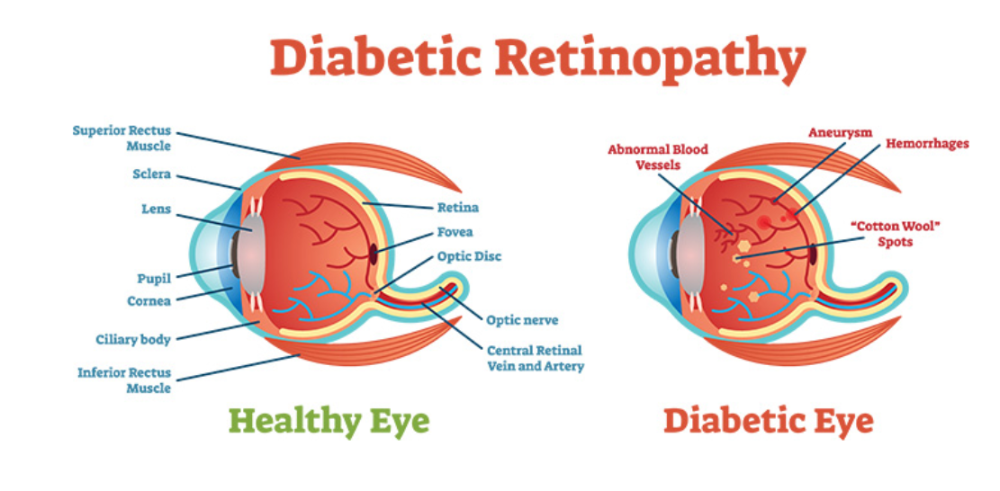
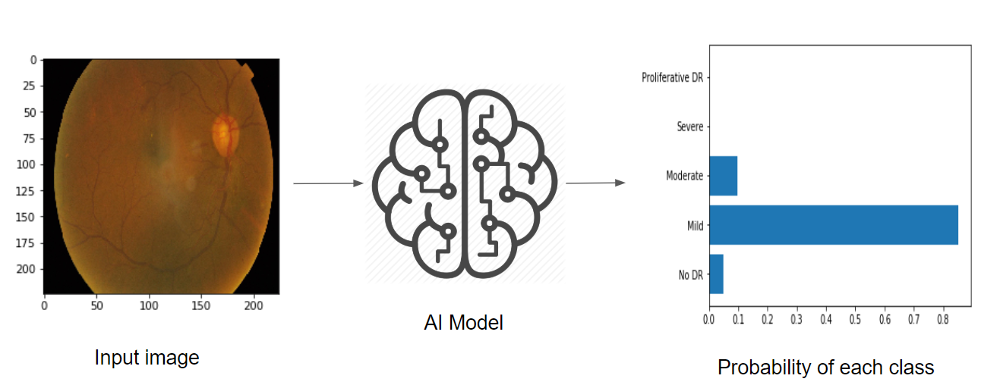
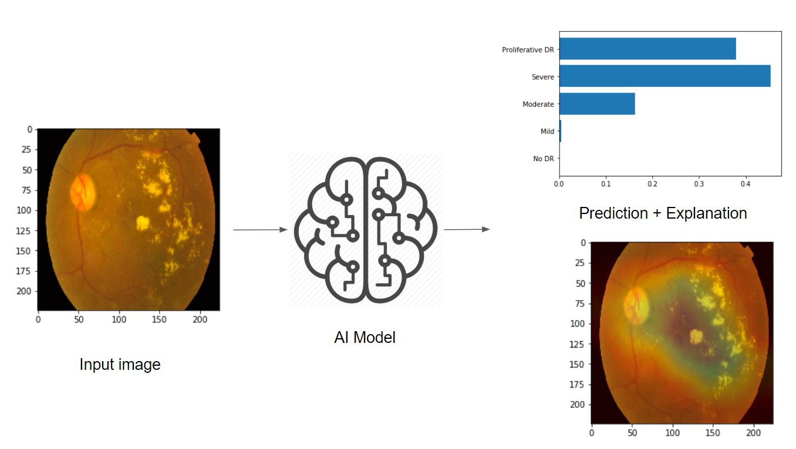

# [APTOS 2019 Blindness Detection](https://www.kaggle.com/c/aptos2019-blindness-detection)
___Detect diabetic retinopathy to stop blindness before it's too late___

## What is Diabetic Retinopathy (DR)?

  

_Source: [Medical Diagnosis with a Convolutional Neural Network, TowardsDataScience](https://medium.com/m/global-identity?redirectUrl=https%3A%2F%2Ftowardsdatascience.com%2Fmedical-diagnosis-with-a-convolutional-neural-network-ab0b6b455a20)_

According to [this article](https://www.diabetes.co.uk/diabetes-complications/diabetic-retinopathy.html):

- Diabetic retinopathy is the most common form of diabetic eye disease. Diabetic retinopathy usually only affects people who have had diabetes (diagnosed or undiagnosed) for a significant number of years.
- Retinopathy can affect all diabetics and becomes particularly dangerous, increasing the risk of blindness, if it is left untreated.
-The risk of developing diabetic retinopathy is known to increase with age as well with less well controlled blood sugar and blood pressure level.
- According to the NHS, 1,280 new cases of blindness caused by diabetic retinopathy are reported each year in England alone, while a further 4,200 people in the country are thought to be at risk of retinopathy-related vision loss.
All people with diabetes should have a dilated eye examination at least once every year to check for diabetic retinopathy.

## Why Computer Vision (CV) for DR diagnosis?

According to the [APTOS Kaggle Comptetion home](https://www.kaggle.com/c/aptos2019-blindness-detection) page:

_Millions of people suffer from diabetic retinopathy, the leading cause of blindness among working aged adults. Aravind Eye Hospital in India hopes to detect and prevent this disease among people living in rural areas where medical screening is difficult to conduct._

___The need to AI:___

_Currently, Aravind technicians travel to these rural areas to capture images and then rely on highly trained doctors to review the images and provide diagnosis. Their goal is to scale their efforts through technology; to gain the ability to automatically screen images for disease and provide information on how severe the condition may be._

## How doctors diagnose DR?

According to [www.eyeops.com](https://www.eyeops.com/contents/our-services/eye-diseases/diabetic-retinopathy), doctors look for at least 5 patterns as in the image below:

_Diabetic retinopathy can result in many serious issues affecting the blood vessels that nourish the retina., Source [https://www.eyeops.com/](https://www.eyeops.com/contents/our-services/eye-diseases/diabetic-retinopathy)_

_Diabetic retinopathy occurs when the damaged blood vessels leak blood and other fluids into your retina, causing swelling and blurry vision. The blood vessels can become blocked, scar tissue can develop, and retinal detachment can eventually occur._

## AI that explains itself

In this work, I was particularly interested in using AI and CV (mainly ConvNets), and visualize the learnt patterns by the ConvNet feature maps, to see if similar patterns as above (Cotton wool spots, Hemorrhages, hard Exudates, Aneurysm and Abnormal growth of blood vessels), are also detected by ConvNets?

# ConvNet model

Some ideas in the code are insipred by this Kaggle [kernel](https://www.kaggle.com/mathormad/aptos-resnet50-baseline).

## Class imabalance

## Small custom model

## ResNet50 model

## Optimization
### ReduceLROnPlateau
### Early stopping
### CyclicalLR
## QWKP metric
